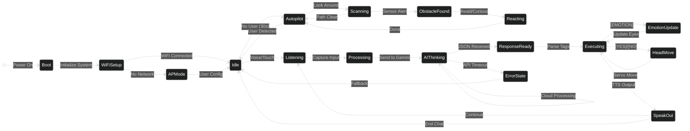
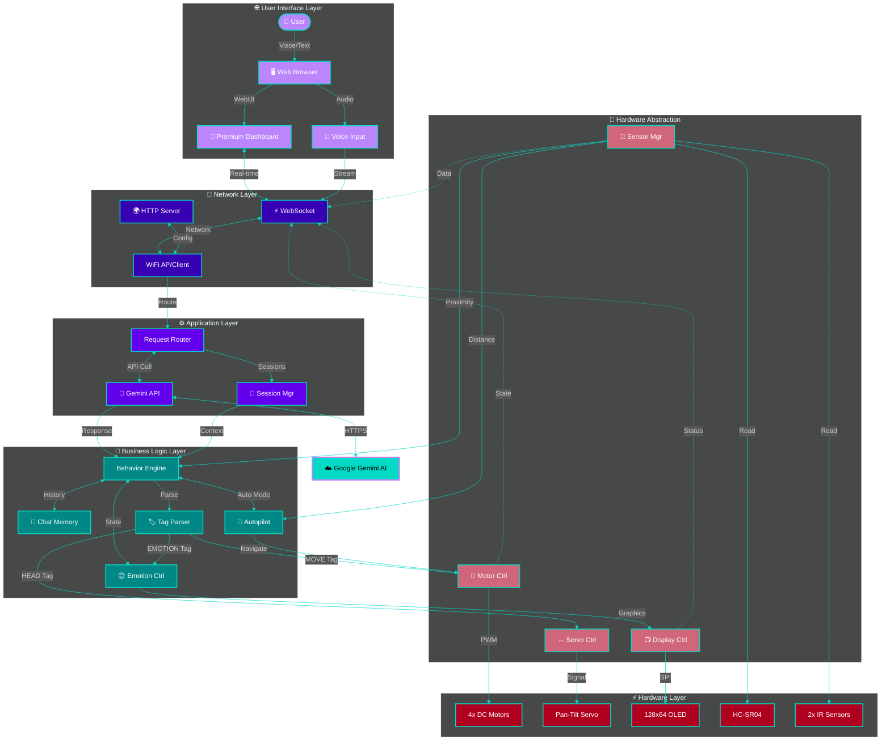

# 🤖 Vextor AI (Vex) - Advanced ESP32 Identity Robot

   

> **"Meow! I am Vextor. A curious and expressive AI cat robot created by Master Mahdi."**

Vextor (Vex) is a professional-grade, open-source AI companion powered by the **ESP32**. It leverages **Google Gemini AI** for advanced reasoning, **Web Speech API** for natural voice interaction, and a custom **Procedural Graphics Engine** for lifelike emotional expressions.

---

## 📌 Complete Hardware Pin Connections

এই section এ সব module/board এর pin connections detail এ দেওয়া আছে।

### 🔌 **Power System**

| Component | Input | Output | Connection |
|-----------|-------|--------|------------|
| **Battery Pack** | 2x 18650 Li-ion | 7.4V - 8.4V | To L298N 12V terminal |
| **L298N Motor Driver** | 7.4V - 8.4V | 5V (regulated) | To ESP32 VIN pin |
| **ESP32** | 5V (VIN) | 3.3V (regulated) | To sensors/modules |
| **Common Ground** | GND | GND | **All GND must connect together** |

> ⚠️ **CRITICAL**: সব components এর GND একসাথে connect করতে হবে signal noise এড়ানোর জন্য!

---

### 📺 **1. OLED Display Module (128x64 SSD1306/SH1106)**

7-pin SPI connection for high-speed 60FPS animations.

#### Direct ESP32 Connection:
| OLED Pin | Wire Color | ESP32 GPIO | Function | Description |
|----------|------------|------------|----------|-------------|
| **GND** | Black | GND | Ground | Common ground |
| **VCC** | Red | 3.3V | Power | 3.3V power supply |
| **D0 (SCL/CLK)** | Yellow | **GPIO 18** | SPI_SCK | Serial clock signal |
| **D1 (SDA/MOSI)** | Green | **GPIO 23** | SPI_MOSI | Master out slave in |
| **RES (RESET)** | Blue | **GPIO 4** | Reset | Hardware reset |
| **DC (A0)** | Purple | **GPIO 5** | Data/Cmd | Data/Command select |
| **CS** | Orange | **GPIO 15** | Chip Select | Chip select (active low) |

#### ESP32 Expansion Board (GVS Headers):
যদি expansion board ব্যবহার করেন (yellow jumper সহ), তাহলে GVS pins ব্যবহার করুন:

| OLED Pin | Expansion Pin | Row | Description |
|----------|---------------|-----|-------------|
| **GND** | Any **G** pin | Ground row | Black wire |
| **VCC** | Any **V** pin | Voltage row (3.3V) | Red wire, jumper on 3.3V |
| **D0** | **D18** | Signal | Yellow wire |
| **D1** | **D23** | Signal | Green wire |
| **RES** | **D4** | Signal | Blue wire |
| **DC** | **D5** | Signal | Purple wire |
| **CS** | **D15** | Signal | Orange wire |

---

### 🚗 **2. L298N Motor Driver Module (4WD System)**

Dual H-bridge driver for 4 DC motors with PWM speed control.

#### Motor Driver to ESP32:
| L298N Pin | ESP32 GPIO | Function | Wire Color |
|-----------|------------|----------|------------|
| **ENA** | **GPIO 32** | Left motors PWM | Yellow |
| **IN1** | **GPIO 33** | Motor direction | Orange |
| **IN2** | **GPIO 25** | Motor direction | Red |
| **IN3** | **GPIO 26** | Motor direction | Brown |
| **IN4** | **GPIO 27** | Motor direction | Green |
| **ENB** | **GPIO 14** | Right motors PWM | Blue |
| **GND** | GND | Common ground | Black |

#### Motor Driver Power:
| Terminal | Connection | Description |
|----------|------------|-------------|
| **12V** | Battery (+) 7.4V-8.4V | Power input |
| **GND** | Battery (-) | Ground |
| **5V OUT** | ESP32 VIN | Regulated 5V to ESP32 |
| **GND OUT** | ESP32 GND | Common ground |

#### Motors to Driver:
| Motor | L298N Terminal | Position |
|-------|----------------|----------|
| **Front Left** | OUT1 (+), OUT2 (-) | Left side |
| **Back Left** | OUT1 (+), OUT2 (-) | Left side (parallel) |
| **Front Right** | OUT3 (+), OUT4 (-) | Right side |
| **Back Right** | OUT3 (+), OUT4 (-) | Right side (parallel) |

---

### 🎯 **3. SG90 Servo Motor (Head Movement)**

Pan-tilt servo for head tracking and scanning.

| Servo Wire | Color | ESP32 GPIO | Function |
|------------|-------|------------|----------|
| **Signal** | Orange/Yellow | **GPIO 13** | PWM control |
| **VCC** | Red | 5V | Power (from L298N 5V) |
| **GND** | Brown/Black | GND | Ground |

> ⚠️ **Safe Range**: 0° to 160° (180° damaged servo!)

---

### 📡 **4. HC-SR04 Ultrasonic Sensor (Distance)**

Measures distance for obstacle avoidance.

| HC-SR04 Pin | ESP32 GPIO | Function | Wire Color |
|-------------|------------|----------|------------|
| **VCC** | 5V | Power | Red |
| **TRIG** | **GPIO 22** | Trigger pulse | Yellow |
| **ECHO** | **GPIO 21** | Echo return | Green |
| **GND** | GND | Ground | Black |

---

### 🔴 **5. IR Proximity Sensors (2x Modules)**

Infrared sensors for front/back obstacle detection.

#### Front IR Sensor:
| IR Pin | ESP32 GPIO | Function | Position |
|--------|------------|----------|----------|
| **VCC** | 3.3V/5V | Power | Front |
| **GND** | GND | Ground | Front |
| **OUT** | **GPIO 34** | Digital output | Front sensor |

#### Back IR Sensor:
| IR Pin | ESP32 GPIO | Function | Position |
|--------|------------|----------|----------|
| **VCC** | 3.3V/5V | Power | Back |
| **GND** | GND | Ground | Back |
| **OUT** | **GPIO 35** | Digital output | Back sensor |

---

### 🎤 **6. INMP441 I2S Digital Microphone (Optional)**

High-quality digital microphone for voice input.

| INMP441 Pin | ESP32 GPIO | Function | Description |
|-------------|------------|----------|-------------|
| **VCC** | 3.3V | Power | 3.3V only! |
| **GND** | GND | Ground | Common ground |
| **SCK** | **GPIO 16** | Serial clock | I2S clock |
| **WS** | **GPIO 19** | Word select | Left/Right channel |
| **SD** | **GPIO 17** | Serial data | Audio data out |
| **L/R** | GND | Channel select | Left channel (GND) |

---

### 📋 **Complete GPIO Pin Assignment Table**

| GPIO | Module | Function | Direction |
|------|--------|----------|-----------|
| **GPIO 4** | OLED | Reset | Output |
| **GPIO 5** | OLED | DC (Data/Command) | Output |
| **GPIO 13** | Servo | PWM Signal | Output |
| **GPIO 14** | Motor | ENB (Right PWM) | Output |
| **GPIO 15** | OLED | CS (Chip Select) | Output |
| **GPIO 16** | Mic (I2S) | SCK | Output |
| **GPIO 17** | Mic (I2S) | SD | Input |
| **GPIO 18** | OLED | CLK (SPI Clock) | Output |
| **GPIO 19** | Mic (I2S) | WS | Output |
| **GPIO 21** | Ultrasonic | Echo | Input |
| **GPIO 22** | Ultrasonic | Trig | Output |
| **GPIO 23** | OLED | MOSI (SPI Data) | Output |
| **GPIO 25** | Motor | IN2 | Output |
| **GPIO 26** | Motor | IN3 | Output |
| **GPIO 27** | Motor | IN4 | Output |
| **GPIO 32** | Motor | ENA (Left PWM) | Output |
| **GPIO 33** | Motor | IN1 | Output |
| **GPIO 34** | IR Sensor | Front OUT | Input (only) |
| **GPIO 35** | IR Sensor | Back OUT | Input (only) |

> ℹ️ **Note**: GPIO 34 এবং 35 শুধু input-only pins, এগুলো output হিসেবে ব্যবহার করা যাবে না।

---

### 🔧 **Recommended Wiring Order**

1. **Power First**: Battery → L298N → ESP32 (check voltages!)
2. **Ground Network**: Connect all GND together
3. **Display**: OLED to ESP32 (test with simple sketch)
4. **Motors**: Connect to L298N outputs
5. **Servo**: Connect to GPIO 13 with 5V power
6. **Sensors**: HC-SR04 and IR sensors
7. **Optional**: I2S Microphone last

### ⚠️ **Important Safety Notes**

- ✅ **Always connect GND first** before applying power
- ✅ **Check polarity** before connecting batteries
- ✅ **Use correct voltage** (3.3V for ESP32, 5V for motors/servo)
- ✅ **Test each module separately** before full integration
- ❌ **Never reverse polarity** on power connections
- ❌ **Don't exceed GPIO current limits** (12mA per pin)

---

## 🧠 System Intelligence & Logic

Vextor's brain operates on a sophisticated state machine, balancing autonomous curiosity with real-time user interaction.

---

## 🏗️ Interactive Architecture

The following diagram illustrates how the Premium Web Dashboard, Cloud AI, and ESP32 Hardware layers interact seamlessly.

---

## 📱 Premium Control Interface

Vextor features a high-performance web dashboard with real-time feedback, system diagnostics, and emotional monitoring.

---

## 🎭 Advanced Behavioral Intelligence

### 🧬 Procedural Emotion Engine
Vextor no longer uses static images. His eyes are rendered in real-time using **mathematical primitives**, allowing for:
- **Dynamic Blinking**: Natural eye intervals that adapt to conversation.
- **Micro-Saccades**: Subtle eye movements that simulate biological life.
- **Emotion Morphing**: Smooth transitions between Neutral, Love, Angry, Shocked, and more.

### 🧠 Gemini AI Persona
Powered by the **Google Gemini Pro** model, Vextor possesses:
- **Cat Identity**: A consistent, playful persona that never breaks character.
- **Bilingual Mastery**: Seamlessly interacts in both **Bengali and English**.
- **Context Awareness**: Remembers recent interactions for flowing conversations.

---

## 🆘 Troubleshooting & Common Issues

### 🔌 1. Serial Port Error (`COM4 busy or doesn't exist`)
If you encounter errors connecting to the ESP32:
*   **Check the Cable**: Ensure you are using a **USB Data Cable** (not a charge-only cable).
*   **Manual Boot Mode**: If the IDE gets stuck at `Connecting.......`, **press and hold the BOOT button** on the ESP32 until the upload starts.

### ⚡ 2. Upload Interrupted (`The chip stopped responding`)
If the upload fails mid-way (e.g., at 72%):
*   **Lower Upload Speed**: Change `Tools > Upload Speed` to **115200** in the Arduino IDE. This provides a more stable connection for large sketches.
*   **Power Interference**: Disconnect external power or unplug motors while uploading. Peripherals can cause noise that crashes the flash process.
*   **Direct USB**: Avoid USB hubs. Connect directly to a motherboard USB port.

### 📉 3. Sketch Size Optimization (92%+)
The current build uses a significant amount of program memory. If you run out of space:
*   **Partition Scheme**: Go to `Tools > Partition Scheme` and select **"Huge APP (3MB No OTA)"**.
*   **Bitmap Management**: Review `bitmaps.h` and remove unused facial expressions.
*   **Library Slimming**: Ensure you aren't including heavy libraries that aren't strictly necessary.

---

## 🚀 Optimized Installation

1.  **Clone & Open**: Open the `Main.ino` in Arduino IDE.
2.  **Install Dependencies**:
    - `Adafruit_SSD1306` & `Adafruit_GFX` (Visuals)
    - `ESP32Servo` (Movement)
    - `ArduinoJson` (Memory)
3.  **Partition Scheme**: Select **Huge APP (3MB No OTA)** in Tools menu.
4.  **Upload & Flash**: Connect ESP32 and hit Upload. Don't forget to upload the `data` folder using the **SPIFFS Upload Tool**.

---

## 🤝 Project Credits
- **Lead Developer**: Master Mahdi
- **AI Architect**: Antigravity Agent
- **Community**: Built with passion and open-source love.

> *"Vextor is not just a robot; he is an optimized companion with a digital soul."* 🚀
