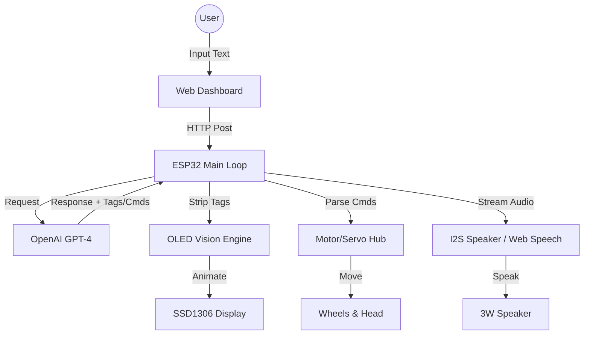

# 🤖 Vextor AI (Vex) - Advanced ESP32 Identity Robot

   

> **"I am Vextor. A robot created by Master Mahdi."**

Vextor (Vex) is a highly advanced, open-source AI desktop robot powered by the ESP32. It combines the intelligence of **OpenAI (ChatGPT)**, the realism of **ElevenLabs TTS**, and a unique, dynamic personality to create a truly living companion. 

Unlike standard AI assistants, Vextor has a **core identity**: he is a robot with attitude (inspired by *Madara Uchiha*), he speaks Bengali (and English), and he never breaks character.

---

## 🇧🇩 ভেক্সটর গাইড: বিস্তারিত তথ্য (Ultimate Bengali Guide)

### ১. ভেক্সটর কি?
ভেক্সটর একটি আস্ত ব্যক্তিত্ব সম্পন্ন এআই রোবট। এটি শুধু আপনার কথা শোনে না, বরং নিজের মেজাজ বা পরিস্থিতি অনুযায়ী প্রতিক্রিয়া দেখায়। এটি **Bengali + English** দুই ভাষাতেই পটু।

### ২. প্রধান বৈশিষ্ট্যসমূহ (Features):
- **মাদারা পার্সোনালিটি**: এটি মাদারা উচিহার মতো গম্ভীর এবং শক্তিশালী মনোভাব দেখায়।
- **মুভমেন্ট কমান্ড**: আপনি চ্যাটে `সামনে যাও` বা `বামে ঘুরো` বললে এটি নিজে নিজেই নড়াচড়া করবে।
- **আবেগ ও এনিমেশন**: ১৬টিরও বেশি ইমোশন (রাগ, ভালোবাসা, হাসি, দুঃখ) এর জন্য আলাদা আলাদা চোখের এনিমেশন।
- **স্মার্ট ওয়েক-আপ**: রোবটটি ঘুমিয়ে থাকলে আপনি মেসেজ দিলে এটি "স্টার্টল" হয়ে লাফ দিয়ে জেগে উঠবে।
- **ওয়েব কন্ট্রোল ড্যাশবোর্ড**: কোনো অ্যাপ ছাড়াই ব্রাউজার থেকে রোবটকে কন্ট্রোল করা যায়।

### ৩. কি কি হার্ডওয়্যার লাগবে (Hardware List):
- **ESP32 Dev Board**: রোবটের মস্তিষ্ক।
- **SSD1306 OLED**: রোবটের দোলনা বা মুখ।
- **MAX98357A Amp**: কথা বলার জন্য ব্রেইন।
- **SG90 Servo**: মাথা ঘুরানোর জন্য।
- **Motor Driver + Gear Motors**: চলার জন্য।
- **HC-SR04 & IR Sensors**: বাধা শনাক্ত করার জন্য।

---

## ⚡ Technical Highlights

- **Asynchronous Execution**: Uses a custom `RobotAction` queue to manage speech, movement, and animations concurrently without blocking the main CPU loop.
- **Fail-Safe Audio**: Intelligent switching between ElevenLabs and Web Speech API ensures zero downtime in vocal interactions.
- **State-Persistent Memory**: Stores persona settings and chat history in SPIFFS (Internal Flash), allowing Vextor to "remember" you across reboots.
- **Dynamic Lip-Sync**: Real-time vowel detection logic maps audio duration to mouth shapes for a natural talking effect.

---

## 🎭 Personality & Behavioral Logic (The "Soul")

Vextor isn't a generic AI; he has a complex personality system:
- **Madara Persona**: His default identity is based on Madara Uchiha. He is often arrogant, powerful, and doesn't like silly questions.
- **Gender-Based Interaction**:
  - **Boys**: Treated with "massive attitude" and skepticism. Expect replies like "Ki chaw?" (What do you want?).
  - **Girls**: Treated with charm and politeness (Charm mode).
- **No-Nonsense Rule**: He will refuse to respond to "I am an AI model" prompts. He *is* Vextor.
- **Emotion Integration**: If he says something funny, his mouth will automatically use a `LAUGH` animation. If he is insulted, his eyes will turn `ANGRY`.

---

## 📜 Version History (Changelog)

### v2.5 - The "Professional" Update (Recent)
- **Functional File Reorganization**: Categorized code into `src/audio`, `src/config`, `src/core`, `src/hardware`, `src/network`, and `src/vision`.
- **Startle Wake-up**: Implemented `WAKE_UP` state with screen shake and wide eyes.
- **AI Body Control**: Full integration of `[CMD:FORWARD/BACK/LEFT/RIGHT/STOP]`.
- **Precise Lip-Sync**: Lips now stop exactly when audio ends via `/stop_talk` feedback.
- **Manual Settings UI**: Added a secure "Settings" tab in WebUI for real-time adjustments.

### v1.0 - Initial Release
- Basic AI identity and ElevenLabs integration.

---

## ✨ Features Breakdown (A-Z)

### 🚀 **Robot Command System (Physical AI Control)**
- **AI-Driven Movement**: Vextor can now control his own body! If you ask him to "Come forward" or "Turn left", the AI generates hidden commands like `[CMD:FORWARD]` or `[CMD:LEFT]` which the hardware executes in real-time.
- **Natural Interaction**: Movement is integrated into his speech, making him feel alive and responsive to your requests.

### 😲 **Wake-Up & Startle Animation**
- **Deep Sleep Mode**: Automatically enters a `SLEEP` state (Zzz animation) to save power.
- **Startle Awake**: When a message is received, Vextor doesn't just wake up—he has a "Startle" animation (`WAKE_UP`) with wide eyes and a screen shake effect before returning to `NEUTRAL`.

### ⚙️ **Advanced Settings Control Panel**
- **Real-Time Persona Tweaking**: Change his "Speaking Style" or "System Prompt" directly from the Web UI without reflashing.
- **API Management**: Easily update OpenAI and ElevenLabs keys through a secure "Settings" tab.
- **Voice Customization**: Change Voice IDs and models on the fly.

### 📁 **Modular Functional Reorganization**
The project code has been professionally refactored into functional modules:
- `src/audio/`: Voice and sound managers.
- `src/config/`: API settings and hardware pins.
- `src/core/`: Action queue and logging logic.
- `src/hardware/`: Real-time body sync and sensor control.
- `src/network/`: AI handlers and the Web Server.
- `src/vision/`: OLED eye animations and bitmaps.

---

## 🎭 How to Customize the Persona (Bistarito)

Vextor is designed to be highly customizable. You can change his entire soul by editing the **System Prompt** in the Web UI Settings:

1. **Identity**: Define who he is (e.g., "You are a friendly cat robot").
2. **Behavior**: Define how he acts (e.g., "Be very polite and use 'meow' at the end of every sentence").
3. **Language**: Tell him which language to prefer (e.g., "Always reply in Sylheti Bengali").
4. **Commands**: Ensure you keep the rule: "Use `[CMD:FORWARD]` when asked to move".

---

## 📂 Project Structure

A modular organization for a professional development workflow:
```text
Main/
├── Main.ino                # Entry point & global state management
├── README.md               # User manual & documentation
├── data/                   # SPIFFS assets (HTML, Config, Logs)
└── src/
    ├── audio/              # tts_manager.h, audio_manager.h
    ├── config/             # config.h, persistent_config.h, api_config.h
    ├── core/               # action_queue.h, logger.h
    ├── hardware/           # hardware_ctrl.h, body_sync.h
    ├── network/            # web_server_manager.h, openai_manager.h, web_content.h
    └── vision/             # bitmaps.h
```

---

## 🛠️ Hardware Requirements & Components

### **Core Components**
| Component | Function | Recommendation |
|-----------|----------|----------------|
| **ESP32 Dev Board** | The Brain | ESP32-WROOM-32 |
| **0.96" OLED Display** | The Face | SSD1306 (128x64) I2C |
| **MAX98357A I2S Amp** | Digital Audio Output | High-quality I2S Amp |
| **2x INMP441 Mic** | Optional Stereo Audio Input | I2S Digital Mics |
| **SG90 Servo** | Head Movement | 180-degree Servo |
| **Motor Driver** | Wheel Control | L293D or L9110S |
| **2x DC Gear Motors** | Locomotion | 6V TT Motors |
| **HC-SR04** | Obstacle Detection | Ultrasonic Sensor |
| **IR Sensors** | Edge/Table Detection | Digital IR Obstacle Sensor |
| **3.7V - 7.4V Battery** | Power Source | Li-ion with Voltage Regulator |

---

## 🛠️ প্রয়োজনীয় সরঞ্জাম (Required Tools)

রোবটটি তৈরি করতে আপনার নিচের সরঞ্জামগুলো প্রয়োজন হবে:
1. **সোল্ডারিং আয়রন (Soldering Iron)**: সার্কিট কানেকশনের জন্য।
2. **জাম্পার ওয়ায়ার (Jumper Wires)**: পিন টু পিন কানেকশন দেওয়ার জন্য।
3. **গ্লু গান (Glue Gun)**: পার্টসগুলো বডির সাথে আটকানোর জন্য।
4. **স্ক্রু ড্রাইভার সেট**: মোটর এবং চেসিস ফিটিং করার জন্য।
5. **ল্যাপটপ/পিসি**: কোড আপলোড এবং কনফিগার করার জন্য।

---

## 💰 Estimated Build Cost (Anumanik khoroch)

Building Vextor is affordable! Here is a rough estimate:
- **Major Components** (ESP32, OLED, Motor Driver, Motors): ~$10 - $15
- **Sensors & Audio** (HC-SR04, I2S Amp, Mic, Servo): ~$8 - $12
- **Structure & Misc** (Battery, Wires, Chassis, Glue): ~$5 - $10
- **Total**: Approx **$25 - $40 (৳৩০০০ - ৳৪৫০০)** depending on where you buy.

---

## 🚀 Installation & Setup

### 1. Wiring (Default Pins)
Follow the pin definitions in `src/config/config.h`:
- **OLED**: SDA (23), SCL (18) *(Software SPI provided in code)*
- **I2S Speaker**: BCLK (19), LRC (21), DIN (2)
- **I2S Mic**: BCLK (14), WS (15), DATA (22)
- **Servo**: Pin 13
- **Motors**: Pins 27, 26, 25, 33
- **Sensors**: Trig (4), Echo (34), IR-L (35), IR-R (32)

### 2. Firmware Upload
1. Open the folder in **Arduino IDE**.
2. **IMPORTANT**: Keep the folder structure as is (`Main/Main.ino` and everything else in `src/`).
3. Install Libraries: `ArduinoJson`, `Adafruit_SSD1306`, `Adafruit_GFX`, `ESP32Servo`.
4. Upload to **ESP32**.

### 3. SPIFFS Setup
- Make sure to upload the data folder content (`/config.json`, `/chat.txt`, etc.) to the ESP32 SPIFFS memory.

---

## 📖 Usage & Interaction

- **Persona**: Vextor doesn't follow orders blindly. He has "attitude". Treat him with respect (especially if you are a boy) or he might get `ANGRY`.
- **Bengali Speech**: He is optimized for Bengali. Type in Bengali and he will reply with his native charm.
- **Manual Overrides**: Use the Web UI Remote Control to drive him manually when AI isn't needed.

---

## 🛠️ Build Guide: Step-by-Step

### 1. Preparing the ESP32
Ensure you have the latest ESP32 board package installed in your Arduino IDE. Set the partition scheme to **Huge APP (3MB No OTA)** to accommodate the AI logic and web server assets.

### 2. Loading the Assets
The `data/` folder contains the `index.html`. You **must** use the "ESP32 Sketch Data Upload" tool to flash this to the SPIFFS partition before the code will work.

### 3. API Keys
Vextor requires:
- [OpenAI API Key](https://platform.openai.com/api-keys)
- [ElevenLabs API Key](https://elevenlabs.io/api)

---

## 💻 Software Stack & Libraries

Vextor lives on a sophisticated software stack designed for low-latency AI interaction:

- **Framework**: [Arduino Core for ESP32](https://github.com/espressif/arduino-esp32)
- **AI Integration**: [OpenAI GPT API](https://openai.com/api/) (Logic & Personality)
- **Voice Engine**: [ElevenLabs API](https://elevenlabs.io/) (Premium Neural Voice)
- **JSON Parsing**: [ArduinoJson](https://arduinojson.org/) (High-speed config handling)
- **Display Driver**: [Adafruit SSD1306](https://github.com/adafruit/Adafruit_SSD1306) & [Adafruit GFX](https://github.com/adafruit/Adafruit-GFX-Library)
- **Physics & Control**: [ESP32Servo](https://github.com/madhephaestus/ESP32Servo)
- **Storage**: SPIFFS (Serial Peripheral Interface Flash File System)

---

## 🔑 How to get API Keys (A-Z Guide)

To make Vextor come to life, you need two essential keys:

### 1. OpenAI (For the Brain)
- Go to [platform.openai.com](https://platform.openai.com/).
- Sign up and create a new **Secret Key**.
- **Important**: Add a small amount of credits (e.g., $5) to your account, or the API will return "Quota Exceeded".

### 2. ElevenLabs (For the Voice)
- Go to [elevenlabs.io](https://elevenlabs.io/).
- Sign up and find your **API Key** in the profile settings.
- Choose a Voice and copy its **Voice ID** (e.g., `21m00Tcm4TlvDq8ikWAM`).

---

## 📂 File System (SPIFFS) Details

Vextor manages his own internal memory. Here is what's inside:
- `/config.json`: Stores your API keys, WiFi credentials, and persona settings.
- `/history.json`: Keeps track of the last 20 messages for conversational context.
- `/chat.txt`: A live log of all conversations (viewable via Web UI).
- `/loc.txt`: Tracks movement and hardware logs.
- `/tts.mp3`: The temporary buffer for speech output.

---

## 🏗️ Architecture & Logic Flow



---

## 🌐 Web UI features (Bistarito)

The Vextor Web Dashboard is a self-hosted, dark-mode command center reachable via any browser on the same WiFi network:

- **💬 Real-Time Chat**: Send messages and see Vextor's emojis-enhanced replies. 
- **🕹️ Remote Joystick**: Control the robot's movement manually (Forward, Back, Left, Right).
- **🎭 Emotion Trigger**: Manually force Vextor into any state (Angry, Love, Skeptical, etc.).
- **⚙️ Dynamic Persona**: Change his system prompt (Madara, Angel, Friend) without reflashing.
- **☁️ API Manager**: Securely update and save OpenAI/ElevenLabs keys to the internal flash memory.
- **🔊 Voice Control**: Toggle between Premium Neural Voice and Browser Native Voice.

---

## 🗺️ Future Roadmap (Notun Potential Features)

We are constantly evolving! Here is what's coming next:

- [ ] **Face Tracking**: Using an ESP32-CAM to make Vextor look directly at you.
- [ ] **Voice Trigger (Wake Word)**: "Hey Vextor!" detection without clicking a button.
- [ ] **Memory Persistence**: Better long-term memory using a cloud database.
- [ ] **Smart Home Integration**: Control your lights and fans by asking Vextor.
- [ ] **Dynamic Dancing**: Syncing body movements to music beats.
- [ ] **Gesture Recognition**: Reacting to hand gestures (wave, stop) via ESP32-CAM.
- [ ] **Self-Charging**: Ability to find a charging dock when battery is low.

---

## 🛠️ Hardware Wiring Guide (Detailed)

| Module | Pin | Role | Connection Type |
|--------|-----|------|-----------------|
| **OLED** | 23 | MOSI | SPI/I2C Data |
| **OLED** | 18 | CLK | Clock |
| **Speaker** | 19 | BCLK | I2S Bit Clock |
| **Speaker** | 21 | LRC | I2S Word Select |
| **Speaker** | 2 | DIN | I2S Data |
| **Servo** | 13 | PWM | Head Control |
| **Motor A** | 27, 26| IN1, IN2| Left Wheels |
| **Motor B** | 25, 33| IN3, IN4| Right Wheels |
| **HC-SR04** | 4 | Trig | Sonar Burst |
| **HC-SR04** | 34 | Echo | Distance Return |
| **IR Left** | 35 | Sig | Edge Detect |
| **IR Right**| 32 | Sig | Edge Detect |

---

## 🛠️ Troubleshooting (Somoy bachanur tips)

| Issue | Solution |
|-------|----------|
| **No Audio** | Check `I2S_SPEAKER_DIN` pin (Pin 2). Ensure 5V to MAX98357A. |
| **OLED Blank** | Verify I2C Pins. Use `OLED_RESET` (Pin 17) if your board requires it. |
| **Wait for API** | If OpenAI is slow, ensure your WiFi signal is strong. |
| **TTS Limit**| If ElevenLabs stops, the WebUI will automatically switch to Browser Voice. |

---

## ⚠️ Safety & Handling (সতর্কতা)

- **Power Supply**: রোবটটিকে পাওয়ার দিতে ভালো মানের ৩.৭ভোল্ট ৩০০০mAh+ লিথিয়াম ব্যাটারি ব্যবহার করুন। নিম্নমানের ব্যাটারি রোবটকে বারবার রিস্টার্ট দিতে পারে।
- **Heat Dissipation**: ESP32 অনেকক্ষণ কাজ করলে গরম হতে পারে, তাই রোবটের ভেতরে বাতাস চলাচলের জায়গা রাখুন।
- **Static Grounding**: OLED এবং Microphone সেন্সরগুলো অনেক সেনসিটিভ, তাই খালি হাতে পিন ধরার সময় সতর্ক থাকুন।
- **Water Proofing**: যেহেতু এটি ইলেকট্রনিক প্রজেক্ট, জল থেকে দূরে রাখুন।

---

## 🔬 Deep Dive: The Algorithms

### 👁️ Natural Gaze Algorithm
Unlike most robots that move eyes constantly, Vextor uses a **Probability-Based Saccade** model. 
- Eyes stay steady 95% of the time (Neutral state).
- Every 5-10 seconds, a random saccade is triggered to a target `(X, Y)` coordinate.
- **Micro-saccades**: High-frequency, low-amplitude jitters are added to simulate the physical vibrations of living eye muscles.

### 👄 Voice-Mouth Synchronization
Instead of random flapping, the mouth animation uses **Time-Estimated Duration Mapping**:
- The response text length is calculated.
- We apply an 85ms/character multiplier (optimized for Bengali speech rate).
- The `isTalkingNow` flag triggers a 4-frame cycling animation that matches the average speed of neural voice playback.

---

## 🤝 Contributing & License

This project is open-source and built for the community.
- **Contribute**: Feel free to open a Pull Request for new emotions or hardware optimizations.
- **License**: MIT License. You are free to use, modify, and distribute this projects as long as you credit Master Mahdi.

---

## 🌍 Community & Support

- **Showcase**: If you build Vextor, share a video with the tag `#VextorRobot`.
- **Questions**: Use the GitHub Issues tab for technical support.
- **Master Mahdi**: Follow the project for more updates on AI robotics.

---

## ❤️ Credits
- **Founder & Master**: Mahdi
- **AI Architect**: Antigravity Agent
- **Community**: Built using open-source libraries and passion.

> *Vextor is not just a robot; he is a friend with a soul in his code.* 🚀
