# 🤖 Vextor AI (Vex) - Advanced ESP32 Identity Robot

   

> **"Meow! I am Vextor. A curious and expressive AI cat robot created by Master Mahdi."**

Vextor (Vex) is a professional-grade, open-source AI companion powered by the **ESP32**. It leverages **Google Gemini AI** for advanced reasoning, **Web Speech API** for natural voice interaction, and a custom **Procedural Graphics Engine** for lifelike emotional expressions.

---

## 🧠 System Intelligence & Logic

Vextor's brain operates on a sophisticated state machine, balancing autonomous curiosity with real-time user interaction.

```mermaid
stateDiagram-v2
    direction LR
    [*] --> 💤_Idle: Power On
    💤_Idle --> 👂_Listening: User Detected
    👂_Listening --> 🧠_Thinking: Capture Input
    🧠_Thinking --> 🧠_Thinking: Gemini AI Processing
    🧠_Thinking --> 🎭_Acting: Response Ready
    🎭_Acting --> 🎭_Acting: Movement + Emotion + Speech
    🎭_Acting --> 💤_Idle: Complete
    🎭_Acting --> 🧠_Thinking: Continuous Dialogue
    💤_Idle --> 😴_DeepSleep: Inactive
    😴_DeepSleep --> 💤_Idle: Interaction
```

---

## 🏗️ Interactive Architecture

The following diagram illustrates how the Premium Web Dashboard, Cloud AI, and ESP32 Hardware layers interact seamlessly.

---

## 📱 Premium Control Interface

Vextor features a high-performance web dashboard with real-time feedback, system diagnostics, and emotional monitoring.

---

## ⚡ Optimized Hardware Architecture

Vextor's hardware is designed for maximum efficiency and stability. Below are the **optimized pin configurations** categorized by component.

### 📺 1. Visual Interface (OLED/IPS)
Optimized for high-speed SPI communication to ensure fluid 60FPS animations.

| OLED Pin | ESP32 GPIO | Role | Description |
| :--- | :--- | :--- | :--- |
| **D0 (SCL/CLK)** | **GPIO 18** | SPI_SCK | Serial Clock |
| **D1 (SDA/MOSI)**| **GPIO 23** | SPI_MOSI| Master Out Slave In |
| **RES (RESET)** | **GPIO 4** | RESET | Hardware Reset |
| **DC (A0)** | **GPIO 2** | DATA/CMD| Data/Command Toggle |
| **CS** | **GPIO 15** | CHIP_SEL| Chip Select |
| **VCC** | 3.3V | POWER | Integrated Power |
| **GND** | GND | GROUND | Common Ground |

### ⚙️ 2. Locomotion System (4WD + Head)
Features a dual-bridge driver with PWM ramping for **optimized power delivery** and silent movement.

| Component | ESP32 GPIO | Driver Pin | Function |
| :--- | :--- | :--- | :--- |
| **Left Motors (PWM)** | **GPIO 32** | ENA | Speed Control (Left) |
| **Motor L1** | **GPIO 33** | IN1 | Direction Control |
| **Motor L2** | **GPIO 25** | IN2 | Direction Control |
| **Motor R1** | **GPIO 26** | IN3 | Direction Control |
| **Motor R2** | **GPIO 27** | IN4 | Direction Control |
| **Right Motors (PWM)**| **GPIO 14** | ENB | Speed Control (Right) |
| **Head Servo** | **GPIO 13** | Signal | Pan-Tilt Navigation |

### 📡 3. Sensory Array & Interaction
Optimized for zero-latency environmental awareness and human interaction.

| Sensor Type | Pin | GPIO | Optimized Role |
| :--- | :--- | :--- | :--- |
| **Ultrasonic Trig** | TRIG | **GPIO 22** | Distance Pulse |
| **Ultrasonic Echo** | ECHO | **GPIO 21** | Return Timing |
| **Left IR Sensor** | OUT | **GPIO 34** | Proximity Detection |
| **Right IR Sensor** | OUT | **GPIO 35** | Proximity Detection |
| **I2S Mic SCK** | SCK | **GPIO 5** | Digital Audio Clock |
| **I2S Mic WS** | WS | **GPIO 19** | Word Select |
| **I2S Mic SD** | SD | **GPIO 12** | Serial Data Out |

---

## 🎭 Advanced Behavioral Intelligence

### 🧬 Procedural Emotion Engine
Vextor no longer uses static images. His eyes are rendered in real-time using **mathematical primitives**, allowing for:
- **Dynamic Blinking**: Natural eye intervals that adapt to conversation.
- **Micro-Saccades**: Subtle eye movements that simulate biological life.
- **Emotion Morphing**: Smooth transitions between Neutral, Love, Angry, Shocked, and more.

### 🧠 Gemini AI Persona
Powered by the **Google Gemini Pro** model, Vextor possesses:
- **Cat Identity**: A consistent, playful persona that never breaks character.
- **Bilingual Mastery**: Seamlessly interacts in both **Bengali and English**.
- **Context Awareness**: Remembers recent interactions for flowing conversations.

---

## 🛠️ Power Management Strategy
For an **optimized build**, follow this high-performance power routing:

1.  **Dual 18650 Cells**: Provides stable 7.4V - 8.4V power.
2.  **Motor Driver (L298N)**: Connect Battery (+) to 12V terminal.
3.  **ESP32 Power**: Use the L298N's 5V output to the ESP32 `VIN` pin.
4.  **Common Ground**: **CRITICAL** - All GND pins must be connected together to prevent signal noise.

---

## 🚀 Optimized Installation

1.  **Clone & Open**: Open the `Main.ino` in Arduino IDE.
2.  **Install Dependencies**:
    - `Adafruit_SSD1306` & `Adafruit_GFX` (Visuals)
    - `ESP32Servo` (Movement)
    - `ArduinoJson` (Memory)
3.  **Partition Scheme**: Select **Huge APP (3MB No OTA)** in Tools menu.
4.  **Upload & Flash**: Connect ESP32 and hit Upload. Don't forget to upload the `data` folder using the **SPIFFS Upload Tool**.

---

## 🤝 Project Credits
- **Lead Developer**: Master Mahdi
- **AI Architect**: Antigravity Agent
- **Community**: Built with passion and open-source love.

> *"Vextor is not just a robot; he is an optimized companion with a digital soul."* 🚀
